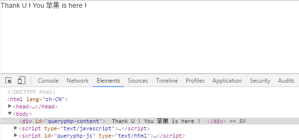

现在前后端分离应用越来越广泛了，后端将数据以 JSON 方式传递给Javascript ，前端通过渲染模板完成界面输出。

介于传统拼接字符串非常难以维护，JS 模板引擎因此越来越多的得到应用，如今已经出现了几十种js模板引擎，国内各大互联网公司也都开发了自己的 js 模板引擎。

那么 QueryPHP 提供与上述的模板引擎有何不同呢，区别那是相当地大，QueryPHP 放弃了 Javascript 本身作为模板引擎编译，而是采用 PHP 输出一个拼接字符串，然后根据这个字符串简单地处理一下输出到浏览器端。

1：HTML 模板中标记：
~~~

~~~

2：PHP 编译成 JS :
~~~

~~~

注意：这是 PHP 编译后的js，这个代码左看右看挺别扭，而且肯定无法运行，这个时候 JS 是时候出场。

3：JS 模板引擎
~~~
/**
 * JS 模板引擎
 * 
 * @param string
 *            id ID、jquery对象或者DOM
 * @param object
 *            $data 数据
 * @returns
 */
template : function(id, $data) {
    "use strict";

    var str = 'var ', temp = [], out = '';

    // 变量赋值
    for ( var k in $data) {
        temp.push(k + " = $data['" + k + "']");
    }
    str += temp.join(", ") + ";\n";

    // 模板内容
    if (typeof id == 'string') {
        id = $('#' + id);
    } else if (!(id instanceof jQuery)) {
        id = $(id);
    }
    str += "out += '" + id.html() + "';";

    // 去掉空格和回车换行
    str = str.replace(/\s+/g, ' ') // 去掉多个空格
    .replace(/[\r\n]/g, ""); // 去掉回车换行

    // 调试语句
    str = "try { "
            + str
            + "} catch ( e ) {"
            + "out = 'template error, see console';"
            + "console.log('%c Query Yet Simple','color:gray;');"
            + "console.log('%c '+e.code + ': ' + e.message,'color:red;');"
            + "}";

    // 执行编译
    eval(str);

    return out;
}
~~~

完整过程：将 $data 数据分解到变量中去，补全字符串，去掉空格和回车，eval 一下执行。

4：测试一下
~~~

~~~

注意：这个模板引擎已经被打包到 jquery.queryphp.js 中，所以这里用法为 $.fn.queryphp 这样子，后面会单独介绍，这里只做一些原理讲解。

浏览器得到如下结果：

模板引擎编译的 EVAL 打印如来如下：
~~~
try {
    var money = $data['money']
      , goods = $data['goods'];
    out += ' ';
    if ((money > 5) ) {
        out += ' Thank U ! You ' + (goods) + ' is here ! ';
    }
    out += ' ';
} catch (e) {
    out = 'template error, see console';
    console.log('%c Query Yet Simple', 'color:gray;');
    console.log('%c ' + e.code + ': ' + e.message, 'color:red;');
}
~~~

部分 PHP 编译器如下：
~~~
    /**
     * Javascript 编译器
     *
     * 采用 Node 编译器核心
     */
    
    // 变量及表达式
    public function jsvarCompiler(&$arrTemplate) {
        $arrTemplate ['content'] = "' + " . $this->parseJsContent_ ( $arrTemplate ['content'] ) . " + '";
    }
    
    // if 编译器
    public function ifJsCompiler(&$arrTemplate) {
        $this->checkNode_ ( $arrTemplate, true );
        $arrAttr = $this->getNodeAttribute_ ( $arrTemplate );
        
        $arrAttr ['condition'] = $this->parseJsContent_ ( $arrAttr ['condition'] );
        
        $sCompiled = "';
if( {$arrAttr['condition']} ) {
    out += '" . $this->getNodeBody ( $arrTemplate ) . "';
}
out += '";
        
        $arrTemplate ['content'] = $sCompiled;
    }
~~~

OK 了，这里就是采用 PHP 和 Javascript 结合开发出来的模板引擎，比较适合特定 PHP 框架预编译模板的场景。
> 优点：不需要 Javascript 编译，只需要简单处理一下拼接字符串就 OK，运行速度快。
缺点：与 PHP 绑定了，只有在某个框架下面，而且必须使用该框架提供的模板引擎。
