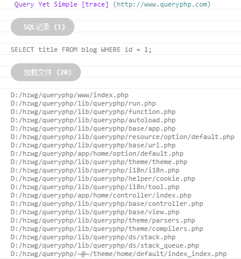

为了方便开发者调试，我们会将当前页面的一些信息，比如 SQL 日志、加载文件等等，以及自定义的一些调试信息输出到 console。

系统默认关闭了调试信息，需要你通过配置打开，首先要打开全局调试
~~~
define ( 'Q_DEBUG', true );
~~~

然后配置里面设置调试打开
~~~
'show_page_trace' => true
~~~

F12 查看 console，然后我们就可以看到如下的界面

> 注意：后面可能会调整细节和功能，整体来说就是这样，还是非常清晰的。
